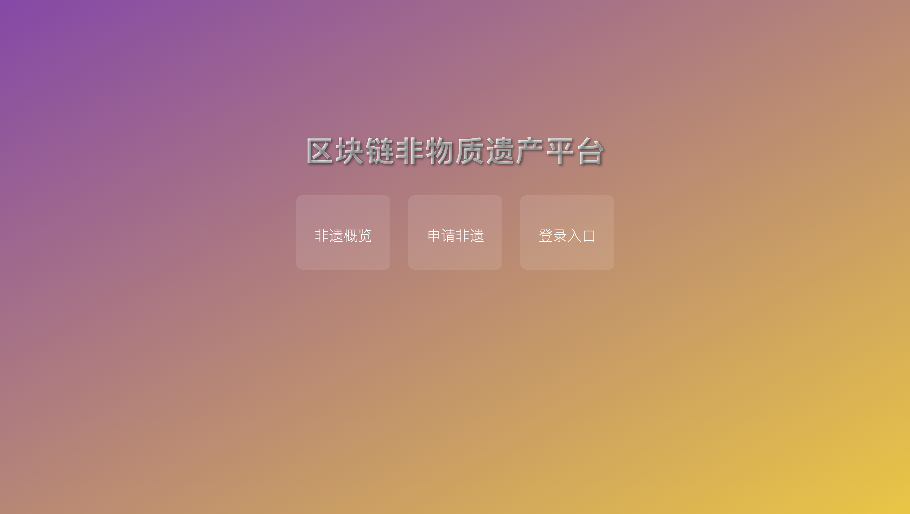
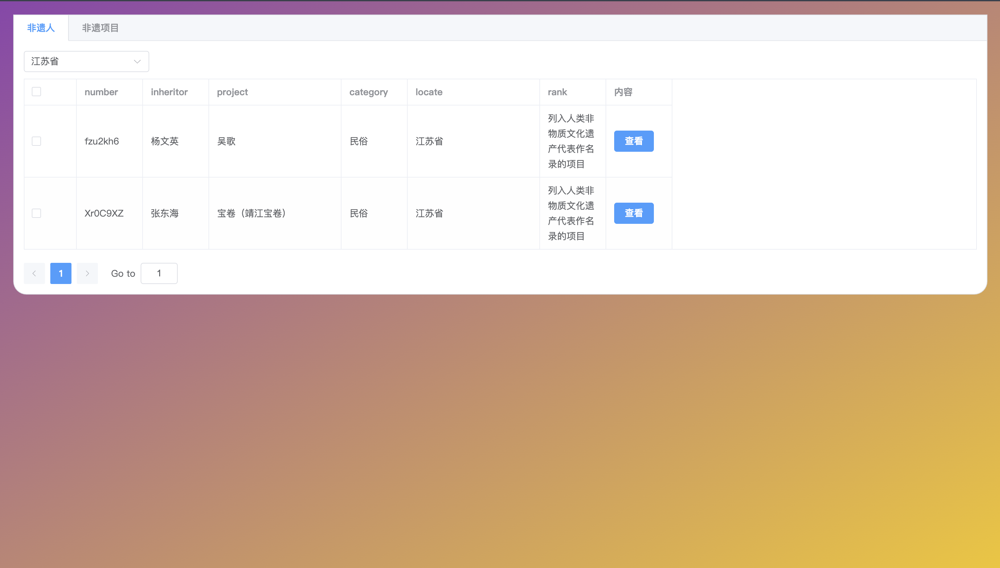
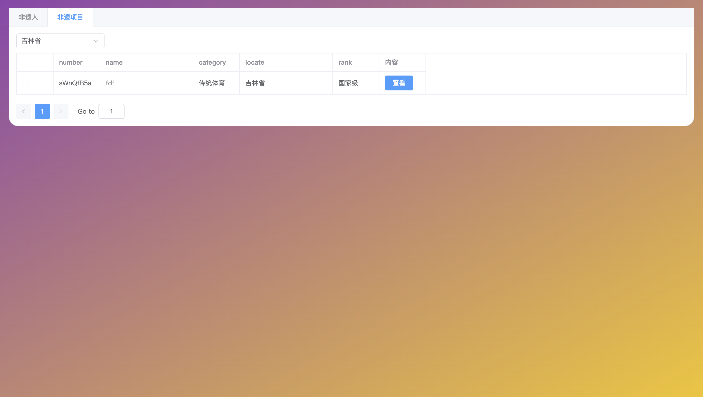
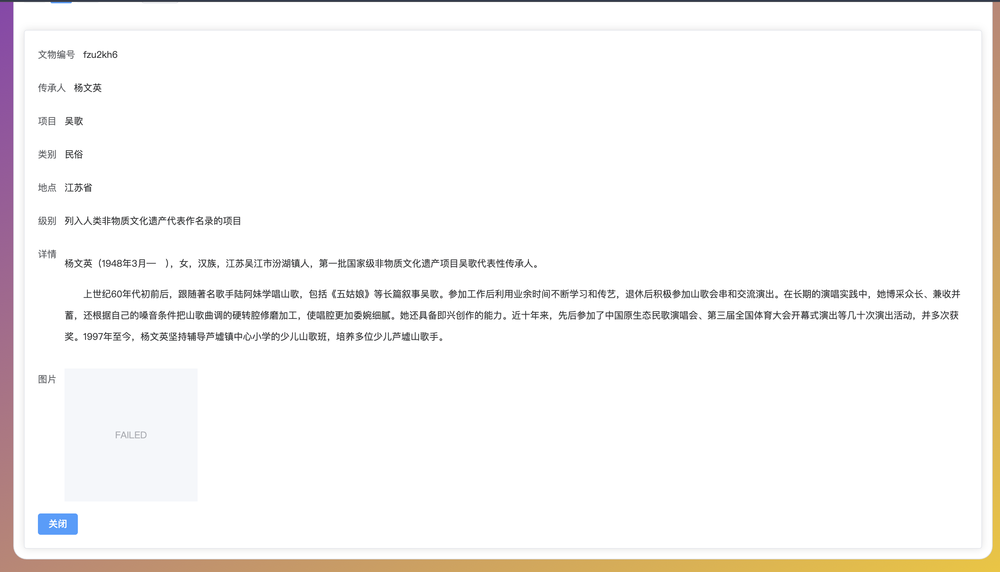
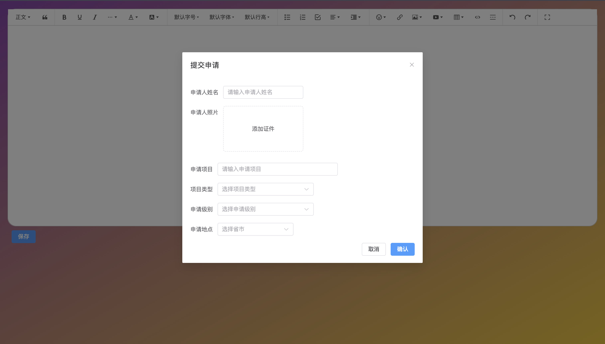
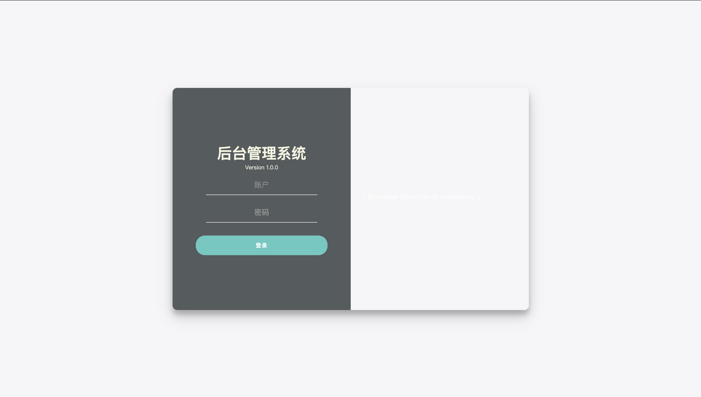
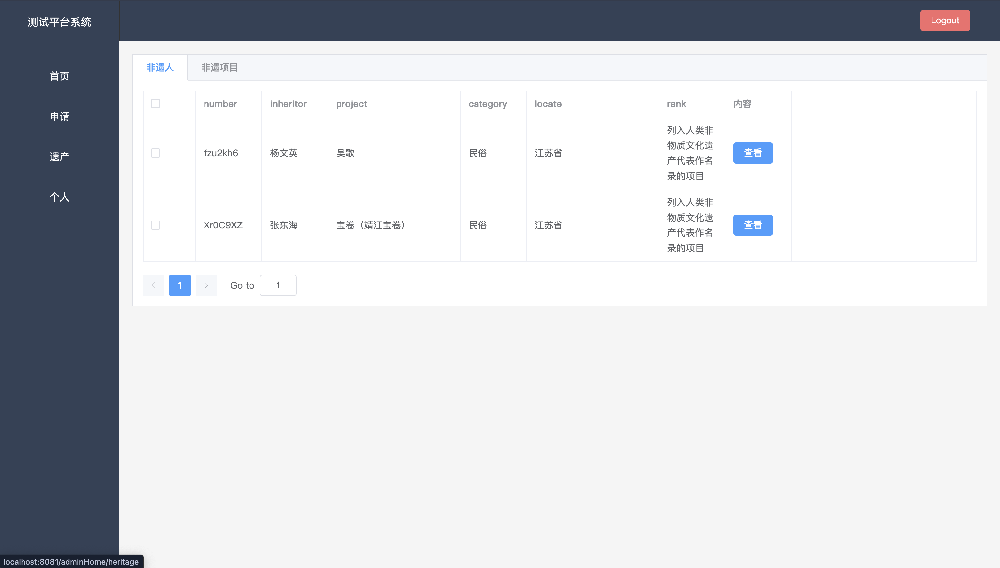
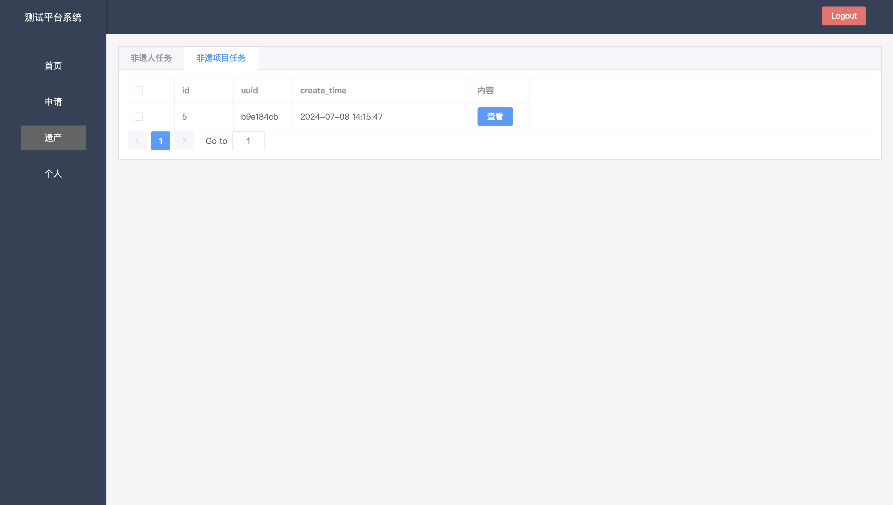

## 区块链非物质文化遗产数字版权保护平台

一个基于Golang Gin的非遗版权保护平台

- 后端基于 [golang](https://go.dev/) + [gin](https://gin-gonic.com/zh-cn/)
- 前端基于 [VUE3](https://vuejs.org/)
## 项目结构 🧐

| 子项目名 | 项目路径                                |
|------|-------------------------------------|
| 后端服务 | [/my_finished/back](./back)         |
| 智能合约 | [/my_finished/contract](./contract) |
| 前端服务 | [/my_finished/front](./front)       |
## 技术栈
- mysql
- redis
- rabbitmq
- gin
- jwt

### 系统截图

[//]: # (<table>)

[//]: # (    <tr>)

[//]: # (        <td></td>)

[//]: # (        <td></td>)

[//]: # (    </tr>)

[//]: # (    <tr>)

[//]: # (        <td></td>)

[//]: # (        <td></td>)

[//]: # (    </tr>)

[//]: # (    <tr>)

[//]: # (        <td></td>)

[//]: # (        <td></td>)

[//]: # (    </tr>)

[//]: # (    <tr>)

[//]: # (        <td></td>)

[//]: # (        <td></td>)

[//]: # (    </tr>)

[//]: # (    <tr>)

[//]: # (        <td></td>)

[//]: # (        <td></td>)

[//]: # (    </tr>)

[//]: # (</table>)
