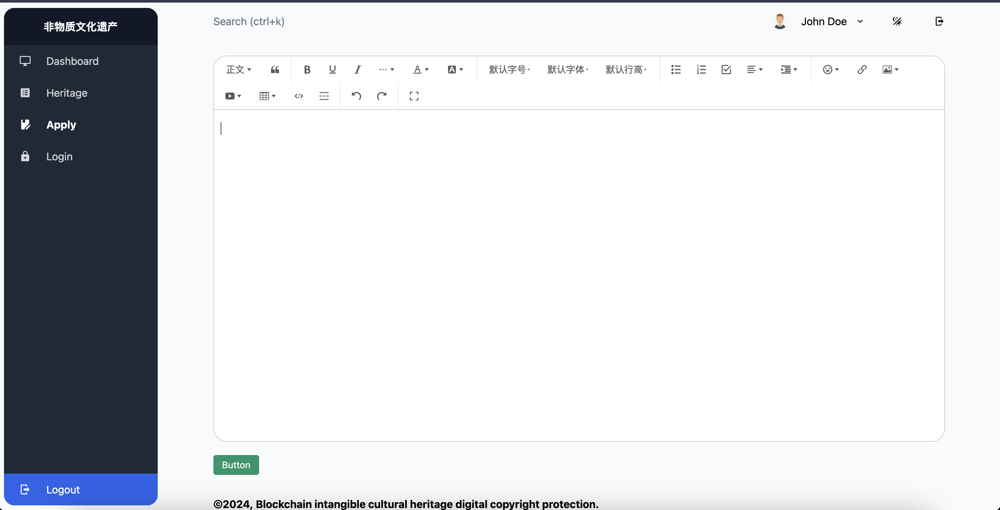
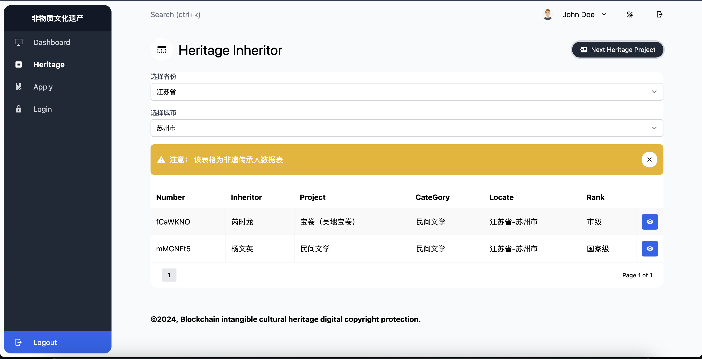
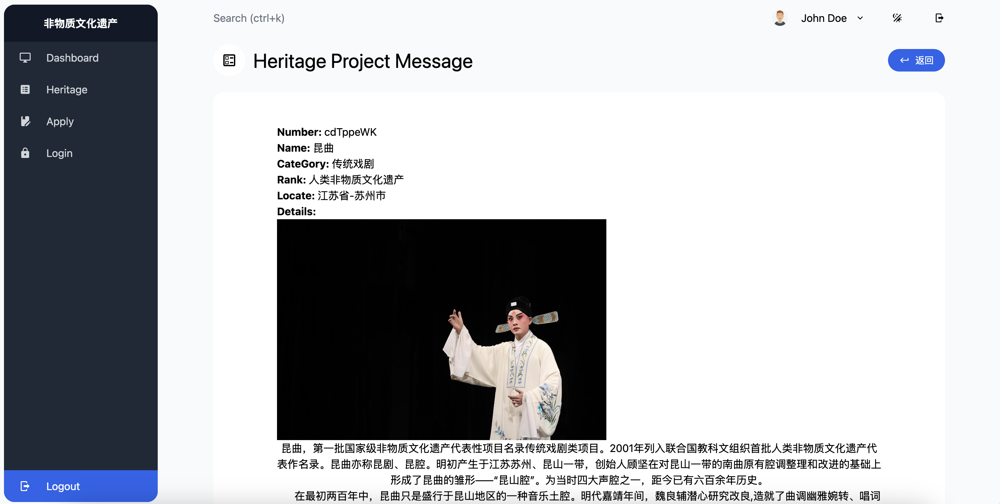
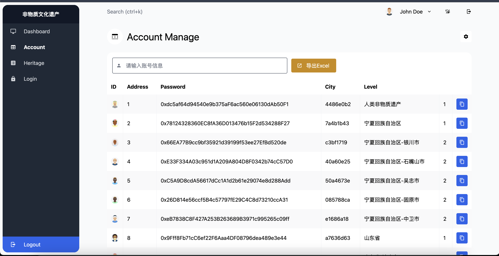

## 区块链非物质文化遗产数字版权保护平台
<div>


[](LICENSE)
</div>

<p><b>摘要：</b>
随着全球化和现代化的进程，许多传统的非物质文化遗产正面临着消失和被遗忘的危险。非物质文化遗产包括口头传统、表演艺术、社会实践、仪式、节庆活动、传统手工艺技能等，它们承载着丰富的历史记忆和文化价值。传统的保护方式存在信息记录不全、数据存储不安全、传承途径单一等问题，亟需新的技术手段来提升保护效率和效果。区块链技术作为一种去中心化、信息公开透明、不可篡改、可溯源的新兴技术，为非物质文化遗产的保护提供了新的解决方案。通过构建基于区块链的非物质文化遗产保护平台，可以实现文化遗产的数字化记录和分布式存储，确保数据的真实可靠性和可追溯性。平台利用智能合约实现自动化和智能化管理，支持非物质文化遗产的数字版权保护和交易，促进文化遗产的合法流通和利用。用户可以通过平台以数字身份参与文化遗产的保护和传承，所有数据公开透明，交易信息可查询，利用大数据和数据可视化技术展示文化遗产的保护状况和传播效果。本课题旨在探索区块链技术在非物质文化遗产保护中的应用，解决传统保护方式的不足，推动文化遗产保护的现代化和信息化，实现文化多样性和文化传承的可持续发展。<br>
<b>关键词：</b>
区块链技术、非物质文化遗产、智能合约、数字化保护、去中心化、数据可追溯、数字身份、大数据可视化、文化传承、分布式存储
</p>

- 后端基于 [golang](https://go.dev/) + [gin](https://gin-gonic.com/zh-cn/)
- 前端基于 [VUE3](https://vuejs.org/)
## 项目结构 🧐

| 子项目名 | 项目路径                                |
|------|-------------------------------------|
| 后端服务 | [back](./back)         |
| 智能合约 | [contract](./contract) |
| 前端服务 | [front](./front)       |
| 一键部署 | [docker](./docker/) |

## 技术栈
- mysql
- redis
- rabbitmq
- gin
- jwt
- vue3 
- javascript
- fisco-bcos
- solidity

## 一键部署
1. 直接拉去镜像
```bash
docker pull registry.cn-hangzhou.aliyuncs.com/ljn_docker_hub/finish:heritage
# 本地构建容器
docker build -t heritage .
```
2. 构建容器
```bash
docker run -it --name=heritage -p 8080:8080 -p 8081:8081 -p 23306:3306 -p 26379:6379 -p 15672:15672 -d registry.cn-hangzhou.aliyuncs.com/ljn_docker_hub/finish:heritage 
```
3. 进入容器自行修改/root/deploy/back/conf/conf.json 合约基础配置
## 系统截图
<table>
    <tr>
        <td></td>
        <td></td>
    </tr>
    <tr>
        <td></td>
        <td></td>
    </tr>
    <tr>
        <td></td>
        <td></td>
    </tr>
    <tr>
        <td></td>
        <td></td>
    </tr>
</table>

### 联系作者
</td>